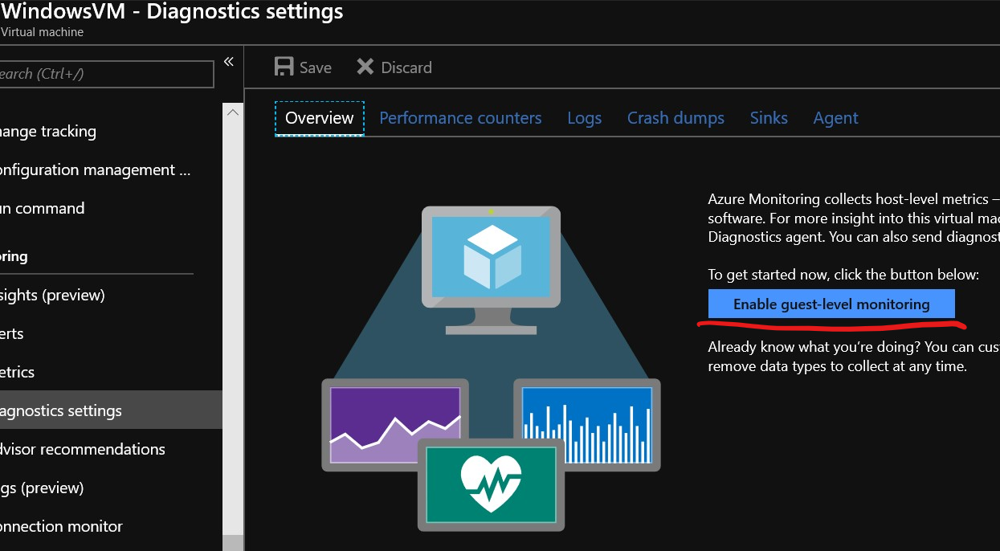
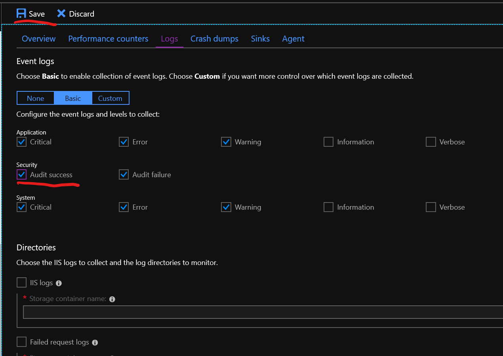
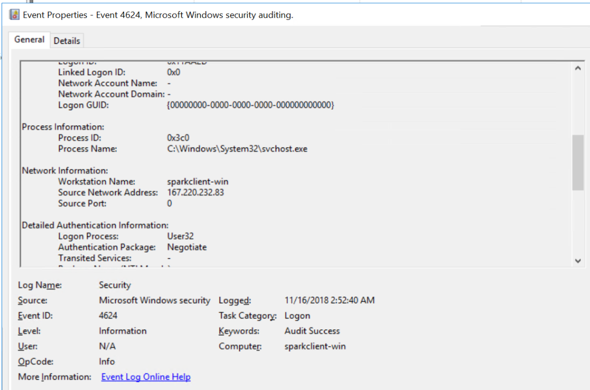
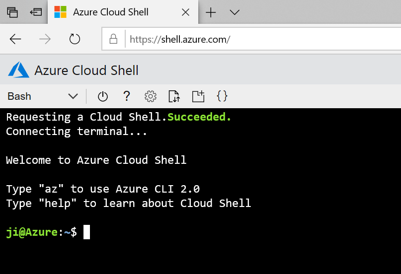
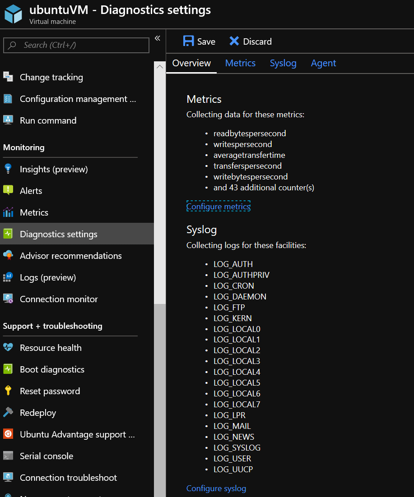
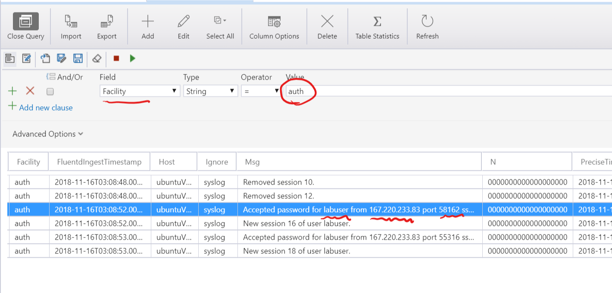

**Azure Diagnostics를 이용한 로그인 정보 로깅하기**

Azure VM으로 RDP/SSH 프로토콜을 이용한 원격 접속에 대한 정보는 각
운영체제별(Windows/Linux)로 시스템 로그(Event Log/syslogs)에 기록이 됩니다.
Azure VM에서는 해당 시스템 로그(Event Log/syslogs)를 Azure Diagnostics logs 기능을 이용하여 Storage Account의 Table과 Blob stroage로 기록하도록 할 수 있습니다.

Diagnostics Log에 대한 좀 더 상세한 정보는 아래의 공식 문서를 참고하시기 바랍니다.

-   Azure 리소스에서 로그 데이터 수집 및 소비
    (<https://docs.microsoft.com/ko-kr/azure/monitoring-and-diagnostics/monitoring-overview-of-diagnostic-logs>)
 
운영 체제별로 로깅 방식이 상이함에 따라서, Azure에서는 운영 체제별(Windows/Linux)로 별도의 Agent를 제공하고 있으며, Windows용 Agent는 WAD(Windows Azure Diagnostics), Linux용은 Linux Azure Diagnostics(LAD)라고 부르고 있습니다.

WAD/LAD는 다양한 방식으로 설정이 가능한데, Azure Portal(https://portal.azure.com)에서 UI를 통하여 설정할 수 있으며, CLI/PowerShell과 같이 명령을 이용하는 방법, Azure Template를 통한 설정방법 등이 있습니다.

**Windows VM 설정 방법**

Azure Portal을 이용한 설정 방법은 아래와 같습니다. 먼저, Windows VM에 대한 설정 방법을 설명하고, 뒤이어 Linux VM에 대한 설정 방법을 공유드리겠습니다.

Azure Portal(https://portal.azure.com)에 접속하여, 설정을 원하는 VM을 선택합니다.
좌측 메뉴에서 Monitoring 항목 아래의 Diagnostics settings를 선택합니다.


다음과 같은 화면이 보여지면, "Enable guest-level monitoring" 버튼을 클릭합니다.



설정이 완료되면, 아래와 같은 화면이 보여지게 됩니다. Azure에 의해서 ubuntuladdiag564라는 Storage Account가 자동으로 생성됩니다.
상단의 메뉴에서 Logs 메뉴를 선택합니다.


다음과 같은 화면이 보여지면, Security 항목의 Audit Success 체크박스를 선택하고, 상단의 Save 버튼을 클릭합니다.



저장이 완료되면, RDP를 이용하여 해당 VM에 로그인을 합니다. 로그인이 성공적으로 이루어지면, 로그인에 대한 정보는 Windows Server의 Event Log에 기록이 되고, 해당 Event Log는 Windows Azure Diagnostics에 의해서 Storage account로 복사됩니다.

Event Log에 기록된 로그는 아래와 같습니다.



Azure Storage Explorer(https://azure.microsoft.com/en-us/features/storage-explorer/)를 열고, 앞서 자동으로 생성된 Storage account를 선택합니다.
해당 storage account 하위에 있는 Tables 항목을 확장하면, WADWindowsEventLogsTable이라는 Table Storage가 보여지게 됩니다. 해당 Table을 클릭합니다.


우측에 Table에 저장된 데이터가 보여지게 됩니다. 상단의 Query 버튼을 클릭합니다.


다음과 같이 쿼리 조건을 설정하고, 초록색 실행 버튼을 클릭합니다.


결과를 확인하면, Description 속성에서 아래와 같이 접속한 클라이언트의 IP 주소와 계정 등, 다양한 정보들을 확인할 수 있습니다.


**Linux VM 설정 방법**

Linux VM도 Windows VM과 동일한 방식으로 Azure Portal을 통하여 설정이 가능합니다.
다만, Azure Portal을 통하여 설정을 하는 경우에는 2.\* 버전의 LAD(Linux Azure Diagnostics)가 설정이 이루어집니다.

안타깝게도 LAD 2.\* 버전에서는 로그인에 대한 정보가 상세하게 기록이 되지 않고 있으며, 로그인 성공/실패에 대한 정보를 로깅하기 위해서는 LAD 3.\* 버전의 설치가 필요합니다.
LAD 3.\* 버전은 CLI/PowerShell을 통하여 설정이 가능하며, 해당 방법은 아래의 링크에서 자세하게 다루고 있습니다.

Linux 진단 확장을 사용하여 메트릭 및 로그 모니터링 (<https://docs.microsoft.com/ko-kr/azure/virtual-machines/extensions/diagnostics-linux>)

Azure CLI는 별도로 설치(https://docs.microsoft.com/en-us/cli/azure/install-azure-cli?view=azure-cli-latest)도 가능하지만, Azure Portal(CloudShell이라고 합니다)에서도 실행할 수 있습니다.
Azure Portal의 CloudShell에는 이미 CLI와 PowerShell이 설치되어 있으므로, 별도의 설치 과정이 필요하지 않습니다.

CloudShell은 Azure Portal 상단의 CloudShell 버튼을 클릭하거나, 


별도의 CloudShell 사이트(https://shell.azure.com/)로 접근하여 실행할 수 있습니다.



앞선 링크에 있는 CLI 쿼리를 복사하여 일부 매개변수만 조정하여 실행하면 됩니다. CloudShell에서 실행하는 경우 예제 코드를 모두 실행할 필요는 없으며, 아래의 CLI만 실행하면 됩니다. 수정할 부분은 \<\<수정할 부분\>\>와 같이 하이라이트 하였습니다.

```bash
\# Set your Azure VM diagnostic parameters correctly below
my_resource_group=\<<리소스 그룹 이름\>>
my_linux_vm=\<<설정하려는 VM 이름\>>
my_diagnostic_storage_account=\<<Diagnostics Log를 저장할 Storage account 이름\>>

\# Download the sample Public settings. (You could also use curl or any web browser)

wget <https://raw.githubusercontent.com/Azure/azure-linux-extensions/master/Diagnostic/tests/lad_2_3_compatible_portal_pub_settings.json> -O portal_public_settings.json

\# Build the VM resource ID. Replace storage account name and resource ID in the public settings.

my_vm_resource_id=\$(az vm show -g \$my_resource_group -n \$my_linux_vm --query "id" -o tsv)
sed -i "s\#__DIAGNOSTIC_STORAGE_ACCOUNT__\#\$my_diagnostic_storage_account\#g" portal_public_settings.json
sed -i "s\#__VM_RESOURCE_ID__\#\$my_vm_resource_id\#g" portal_public_settings.json

\# Build the protected settings (storage account SAS token)
my_diagnostic_storage_account_sastoken=\$(az storage account generate-sas--account-name \$my_diagnostic_storage_account --expiry 2037-12-31T23:59:00Z --permissions wlacu --resource-types co --services bt -o tsv)
my_lad_protected_settings="{'storageAccountName': '\$my_diagnostic_storage_account', 'storageAccountSasToken': '\$my_diagnostic_storage_account_sastoken'}"

\# Finallly tell Azure to install and enable the extension
az vm extension set --publisher Microsoft.Azure.Diagnostics --name LinuxDiagnostic --version 3.0 --resource-group \$my_resource_group --vm-name \$my_linux_vm --protected-settings "\${my_lad_protected_settings}" --settings portal_public_settings.json
```


설정이 완료된 이후에, ssh를 이용하여 Linux VM으로 접근을 하면 syslog에 해당 정보가 기록이 되고, LAD(Linux Azure Diagnostics)에 의해서 해당 Storage account로 로그가 복사됩니다.

Linux VM의 LAD(Linux Azure Diagnostics) 설정은 WAD(Windows Azure Diagnostics)와는 조금 상이하며, 다음과 같습니다.



로그는 앞서 WAD(Windows Azure Diagnostics) 로그를 확인하는 방법과 같이, Azure Storage Explorer에서 확인하는 방법과 같습니다.
다만, Linux VM의 경우에는 저장되는 Table이 다르며, LinuxSyslogVer2v0라는 Table에 저장됩니다.

또한, 로깅되는 데이터의 기준이 각 Linux Distro별로 조금씩 다르다른 점은 유의해야 합니다.
Ubuntu의 경우에는 로그인 정보는 아래와 같이 Faclity의 유형을 auth로 설정해야만 검색이 가능합니다.



CentOS의 경우에는 아래와 같이 Facility 유형을 authpriv로 설정해야만 검색이 가능합니다.

